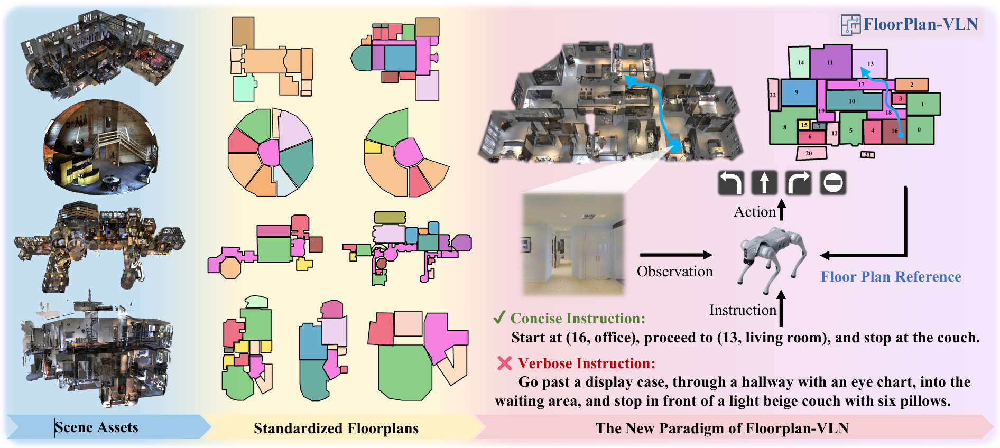

<div align="center">

<h2>FloorPlan-VLN: A New Paradigm for Floor Plan Guided Vision-Language Nagation</h2>

<div>
    <a href='https://github.com/Chenkehan21' target='_blank'>Kehan Chen</a>;
    <a href='https://yanrockhuang.github.io/' target='_blank'>Yan Huang</a>;
    <a href='https://marsaki.github.io/' target='_blank'>Dong An</a>;
    <a href='https://jiaweihe.com/' target='_blank'>Jiawei He</a>;
    <a href='https://github.com/yifeisu' target='_blank'>Yifei Su</a>;
    <a href='https://github.com/yifeisu' target='_blank'>Jing Liu</a>;
    <a href='https://scholar.google.com/citations?user=I-NXbwIAAAAJ&hl=zh-CN' target='_blank'>Nianfeng Liu</a>;
    <a href='https://scholar.google.com/citations?user=8kzzUboAAAAJ&hl=zh-CN' target='_blank'>Liang Wang+</a>;
</div>

<!-- <h3><strong>Accepted to <a href='https://ieeexplore.ieee.org/xpl/RecentIssue.jsp?punumber=34' target='_blank'>TPAMI 2024</a></strong></h3> -->

<h3 align="center">
  <a href="" target='_blank'>[Paper]</a>
  <!-- <a href="https://chenkehan21.github.io/CA-Nav-project/" target='_blank'>[Project]</a> -->
  <!-- <a href="https://github.com/Chenkehan21/svm-nav" target='_blank'>[Real Robot Deployment]</a> -->
</h3>
</div>

Existing Vision-Language Navigation (VLN) paradigms require agents to follow verbose instructions without global spatial priors, limiting their capability to reason about spatial structures. Although human-readable spatial schematics (e.g., floor plans or guide maps) are ubiquitous in real-world buildings, current agents lack the cognitive ability to comprehend and utilize them. To bridge this gap, we introduce FloorPlan-VLN, a new paradigm that leverages structured semantic floor plans as global spatial priors to enable navigation with only concise, practical instructions. First, we construct the FloorPlan-VLN dataset, comprising over 10K episodes across 72 scenes, pairing more than 100 semantically annotated floor plans with Matterport3D-based navigation trajectories and concise instructions. Then, we propose a simple yet effective method FP-Nav that uses a dual-view, spatio-temporally aligned video sequence, and auxiliary reasoning tasks to align observations, floor plans, and instructions. When evaluated under this new benchmark, our method significantly outperforms adapted state-of-the-art VLN baselines, achieving more than a 60\% relative improvement in navigation success rate. Furthermore, comprehensive noise modeling and real-world deployments demonstrate the feasibility and robustness of FP-Nav to actuation drift and geometric map distortions. These results validate the effectiveness of floor plan guided navigation and highlight FloorPlan-VLN as a promising step toward more spatially intelligent navigation.

<div align="center">
    
    <!-- 
     -->
</div>

# TODO:
- [x] Release MP3D floor plan
- [x] Release FPNav model 
- [x] Release finetune json files
- [x] Release Val-seen and Val-unseen evaluation files
- [x] Release FloorPlan-VLN-R2R finetune data
- [ ] Release FloorPlan-VLN-RxR finetune data
- [x] Release FloorPlan Dataset construction code

# Quick Start:

## Data and Model
1. Download Matterport3D Scenes:
   Matterport3D (MP3D) scene reconstructions are used. The official Matterport3D download script (`download_mp.py`) can be accessed by following the instructions on their [project webpage](https://niessner.github.io/Matterport/). The scene data can then be downloaded:
   ```bash
   # requires running with python 2.7
   python download_mp.py --task habitat -o data/scene_datasets/mp3d/
   ```

    Extract such that it has the form `scene_datasets/mp3d/{scene}/{scene}.glb`. There should be 90 scenes. Place the `scene_datasets` folder in `data/`.
2. Download [Matterport-3D Floor Plans](https://huggingface.co/datasets/keeehan/FloorPlan-VLN/tree/main/mp3d_floorplan)
3. Download [FloorPlan-VLN-R2R](https://huggingface.co/datasets/keeehan/FloorPlan-VLN/tree/main/FloorPlan-VLN-R2R) and [FloorPlan-VLN-R2xR](https://huggingface.co/datasets/keeehan/FloorPlan-VLN/tree/main/FloorPlan-VLN-RxR) data for evaluation.
4. Download [FloorPlan-VLN-R2R-tar](https://huggingface.co/datasets/keeehan/FloorPlan-VLN-R2R/tree/main) for finetune:
    ```
    cd FloorPlan-VLN-R2R-tar
    cat FloorPlan-VLN-R2R.tar.* > FloorPlan-VLN-R2R.tar
    tar -xvf full_archive.tar
    ```
5. Downlaod [FloorPlan-VLN-RxR-tar]() for finetune:
    ```
    cd FloorPlan-VLN-RxR-tar
    cat FloorPlan-VLN-RxR.tar.* > FloorPlan-VLN-RxR.tar
    tar -xvf full_archive.tar
    ```
6. Download [FloorPlan-VLN-R2R-finetune-json](https://huggingface.co/datasets/keeehan/FloorPlan-VLN/blob/main/floorplan_vln_r2r_finetune.json) and [FloorPlan-VLN-RxR-finetune-json](https://huggingface.co/datasets/keeehan/FloorPlan-VLN/blob/main/floorplan_vln_rxr_finetune.json) for finetune
7. Download [FP-Nav](https://huggingface.co/keeehan/FloorPlan-VLN/tree/main/fp-nav-vision-r2r-rxr-lr-4e-5-videoframe6) model for evaluation.

Overall, data are organized as follows:

```
FloorPlan-VLN
├── models
│    ├── Qwen-2.5-VL-7B-Instruct
│    └── fp-nav-vision-r2r-rxr-lr-4e-5-videoframe6
├── qwen-vl-finetune
│    ├── data
│    │   ├── mp3d_floorplan
│    │   │    ├── 1LXtFkjw3qL/floorplan.json
│    │   │    ├── ...
│    │   ├── FloorPlan-VLN-R2R
│    │   │    └── r2r/train
│    │   │             ├── 1LXtFkjw3qL/0.mp4
│    |   │             ├── ...
│    │   ├── FloorPlan-VLN-RxR
│    |   │    └── rxr/train
│    │   │             ├── 1LXtFkjw3qL/0.mp4
│    |   │             ├── ...
│    │   ├── floorplan_vln_r2r_finetune.json
│    │   ├── floorplan_vln_rxr_finetune.json
│    ├── scripts
│    ├── ...
├── VLN-CE
│    ├── data
│    │   ├── datasets
│    │   │    ├── FloorPlan-VLN-R2R
│    │   │    │        ├── val_seen
|    │   |    │        │      ├── val_seen.json.gz
│    │   │    │        |      └── val_seen_gt.json.gz
│    │   │    |        └── val_unseen
│    │   │    │               ├── val_unseen.json.gz
│    │   │    │               └── val_unseen_gt.json.gz
│    │   │    └── FloorPlan-VLN-RxR
│    │   │             ├── val_seen
│    │   │             |      ├── val_seen.json.gz
│    │   │             |      └── val_seen_gt.json.gz
│    │   │             └── val_unseen
│    │   │                    ├── val_unseen.json.gz
│    │   │                    └── val_unseen_gt.json.gz
│    │   └── scene_datasets/mp3d
|    ├── ...
├── ...

```

## Installatin for finetuning
**NOTE: We finetune Qwen-2.5-VL-7B on 4 H100 80GB GPUs.**

1. Create a virtual environment. We develop this project with Python 3.12:

   ```bash
   conda create -n FP-Nav python==3.12.7
   conda activate FP-Nav
   ```

2. Install Qwen-2.5-VL requirements (More details in [README_QWEN.md](./README_QWEN.md)):
    ```
    pip install transformers==4.51.3 accelerate
    cd qwen-vl-finetune
    pip install -r requirements.txt
    ```

3. Check requirements and more details according to the [README_Finetune.md](qwen-vl-finetune/README_Finetune.md)

## Finetune
To reproduce the fine-tuning process described in our paper, you will need the pre-trained Qwen model. You can set this up in two ways:

- Option 1 (Automatic): Directly use the Hugging Face Repo ID `Qwen/Qwen2.5-VL-7B-Instruct` in the bash script.

- Option 2 (Manual): Download the model weights manually from Hugging Face and place them in the following directory: FloorPlan-VLN/models/Qwen-2.5-VL-7B-Instruct/.

```bash
cd FloorPlan-VLN/qwen-vl-finetune
bash scripts/sft_7b_fpnav_r2r_rxr_vision.sh # remember to specify the 'llm' path in bash file.
```

## Installation for evaluation

**NOTE: Some GPUS such as H100 may not support to install habitat. We evaluate on 8 3090 GPUs.**

1. Activate the conda environment:

   ```bash
   conda activate FP-Nav
   ```

2. Install `habitat-sim-v0.1.7` for a machine with multiple GPUs or without an attached display (i.e. a cluster):

    ```bash
    git clone https://github.com/facebookresearch/habitat-sim.git
    cd habitat-sim
    git checkout tags/v0.1.7
    pip install -r requirements.txt
    python setup.py install --headless
    ```

3. Install `habitat-lab-v0.1.7`:

    ```bash
    git clone https://github.com/facebookresearch/habitat-lab.git
    cd habitat-lab
    git checkout tags/v0.1.7
    cd habitat_baselines/rl
    vi requirements.txt # delete tensorflow==1.13.1
    cd ../../ # (return to habitat-lab direction)
    
    pip install torch==1.10.0+cu111 torchvision==0.11.0+cu111 torchaudio==0.10.0 -f https://download.pytorch.org/whl/torch_stable.html

    pip install -r requirements.txt
    python setup.py develop --all # install habitat and habitat_baselines; If the installation fails, try again, most of the time it is due to network problems

    # if install failed, try: pip install -e .[all]
    ```

    If you encounter some problems and failed to install habitat, please try to follow the [Official Habitat Installation Guide](https://github.com/facebookresearch/habitat-lab#installation) to install [`habitat-lab`](https://github.com/facebookresearch/habitat-lab) and [`habitat-sim`](https://github.com/facebookresearch/habitat-sim). We use version [`v0.1.7`](https://github.com/facebookresearch/habitat-lab/releases/tag/v0.1.7) in our experiments, same as in the VLN-CE, please refer to the [VLN-CE](https://github.com/jacobkrantz/VLN-CE) page for more details.

4. Install requirements:
    ```
    cd FloorPlan-VLN/VLN-CE
    pip install -r requirements.txt
    ```
## Evaluate
Before start evaluation, you should:
1. Check [fp-nav.yaml](VLN_CE/vlnce_baselines/config/fp-nav.yaml), set the correct `BASE_TASK_CONFIG_PATH`, `SPLIT`
2. Check [fp-nav-r2r.yaml](VLN_CE/habitat_extensions/config/fp-nav-r2r.yaml) and set the correct `DATA_PATH` and `SCENE_DIR`

To start multi-gpu evaluation:
```
cd FloorPlan-VLN
bash eval_fp_nav.sh
```

The results will saved at `tmp/<your experiment name>`, to calculate the metrics, run:
```
cd FloorPlan-VLN
python analyze_results.py --path tmp/<your experiment name>
```
## Dataset construction
```
cd FloorPlan-VLN-Dataset
```
The step of construct `FloorPlan-VLN-R2R/RxR Dataset`, `Navigation QA Dataset` and `Auxiliary Task Dataset` for finetue are as follows:

*(The data construction process is quite complex. I haven't had time to further integrate the code yet, so I’m providing a brief explanation rather than a detailed execution guide.)*

1. `collect_navigation_dataset.py`: construct mp3d floor plans and filter valid episodes.
2. `collect_navigation_step_images.py`: record navigation images step-by-step in habitat
3. `images2videos.py`: turn images to videos for each episode
4. `rebalance_actions.py`: merge consecutive actions and upsample low frequency actions such as stop
5. `resample_videos_mp.py`: resampling videos according to the rebalanced actions.
6. `collect_floorplan_step_images.py`: plot trajector(after action rebalancing) on floor plans.
7. `images2videos.py`: create floor plan navigation videos.
8. `concate_videos.py`: create spatio-temporally aligned videos.
9. `construct_floorplan_instruction.py`: construct concise instructions for FloorPlan-VLN that only refer to start region, target region and stop conditions.
10. `construct_auxiliary_tasks.py` construct auxiliary tasks.
11. `construct_finetune_json_files`: construct QA samples for finetune.


## Contact Information

* kehan.chen@cripac.ia.ac.cn, [Kehan Chen](https://github.com/Chenkehan21)

## Acknowledge
Our implementations are partially inspired by [NaVid](https://pku-epic.github.io/NaVid/) and [NaVILA](https://navila-bot.github.io/).
Thanks for the great works!